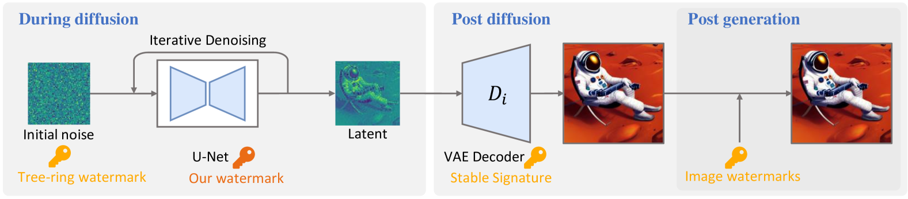

# AquaLoRA: Toward White-box Protection for Customized Stable Diffusion Models via Watermark LoRA

[](https://arxiv.org/abs/2405.11135)

This repository hosts the official PyTorch implementation of the paper: ["**AquaLoRA: Toward White-box Protection for Customized Stable Diffusion Models via Watermark LoRA**"](https://arxiv.org/abs/2405.11135) (Accepted by ICML 2024).

## Method



We introduce AquaLoRA, the first implementation addressing white-box protection. Our approach integrates watermark information directly into the U-Net of SD models using a watermark LoRA module in a two-stage process. This module includes a scaling matrix, enabling flexible message updates without retraining. To maintain image fidelity, we design Prior Preserving Fine-Tuning to ensure watermark integration with small impact on the distribution. Our extensive experiments and ablation studies validate the effectiveness of our design.

## Getting Started

### Prerequisites

Run the following command to install the environment:

```bash
git clone https://github.com/Georgefwt/AquaLoRA.git
cd AquaLoRA
conda create -n aqualora python=3.10
conda activate aqualora
pip install -r requirements.txt
```

### Training

See [train/README.md](train/README.md) for details.

### Evaluation

See [evaluation/README.md](evaluation/README.md) for details.

### Usage

We provide a script to merge LoRA into the Stable Diffusion model itself, enabling protection for customized models. You can run:

```bash
cd scripts
python diffusers_lora_to_webui.py --src_lora <your train folder>/<secret message>/pytorch_lora_weights.safetensors --tgt_lora watermark.safetensors
python merge_lora.py --sd_model <customized model safetensors> --models watermark.safetensors --save_to watermark_SDmodel.safetensors
```

### Trained Models

coming soon~

### TODOs

- [x] training code
- [x] evaluation code
- [x] release training dataset
- [ ] release trained checkpoints

## Acknowledgements

This code builds on the code from the [diffusers](https://github.com/huggingface/diffusers) library. In addition, we borrow code from the following repositories:

- [sd-scripts](https://github.com/kohya-ss/sd-scripts) for merge the LoRA with the model.
- [dreamsim](https://github.com/ssundaram21/dreamsim) for calculate dreamsim metric.
- [pytorch-fid](https://github.com/mseitzer/pytorch-fid) for calculate FID metric.

## Citation

If you use this code for your research, please cite the following work:

```
@article{feng2024aqualora,
  title={AquaLoRA: Toward White-box Protection for Customized Stable Diffusion Models via Watermark LoRA},
  author={Feng, Weitao and Zhou, Wenbo and He, Jiyan and Zhang, Jie and Wei, Tianyi and Li, Guanlin and Zhang, Tianwei and Zhang, Weiming and Yu, Nenghai},
  journal={arXiv preprint arXiv:2405.11135},
  year={2024}
}
```
